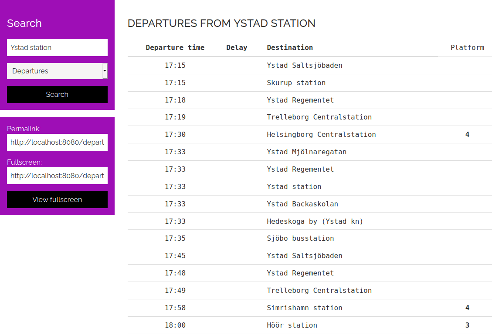

# Departure board demo (PHP)

This demo application shows how you can easily use Trafiklabs APIs to create a website that shows public transport departures
and arrivals. It makes use of the PHP SDKs available on the Trafiklab Github organisation. 

Data is loaded through the [ResRobot Stolptidstabeller API](https://www.trafiklab.se/api/resrobot-stolptidtabeller-2)
     or the [SL Realtidsinformation 4 API](https://www.trafiklab.se/api/sl-realtidsinformation-4).
     
## Setup
- Clone this repository
- Run `composer install`
- Copy the example config file `.env.example` to `.env`
- Set `APP_DATASOURCE` to either `RESROBOT` or `SL`
- Enter the API keys for the datasource you want to use. You can obtain the free API keys at [trafiklab.se](https://trafiklab.se).
- Run `php artisan key:generate`
- Access the application through a server of your choice.
- If you don't have server software installed, you can use PHP's built-in server through the command `php -S localhost:8000 -t public`.
This will make your application available on (localhost:8000)[http://localhost:8000].

## Screenshot

## Contributions and support
This is a demo project, which comes without support. Should you come across bugs, you can report them through the Github Issue tracker, but there is no guarantee on if or when it would be resolved.
If you've added features or if you improved it in any other way, we're welcoming pull-requests to incorporate them in the official project!

### Warranty
This code comes without any warranties. It might stop functioning or even contain security issues unknown to the author. Use at your own risk.
